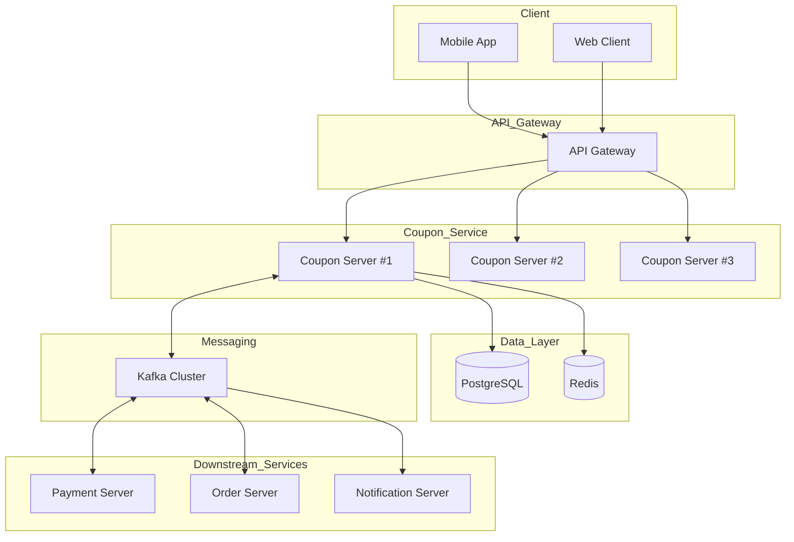
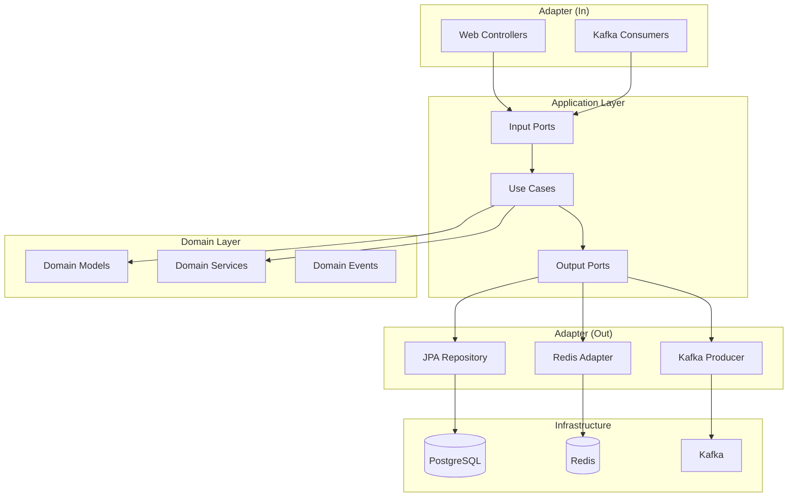
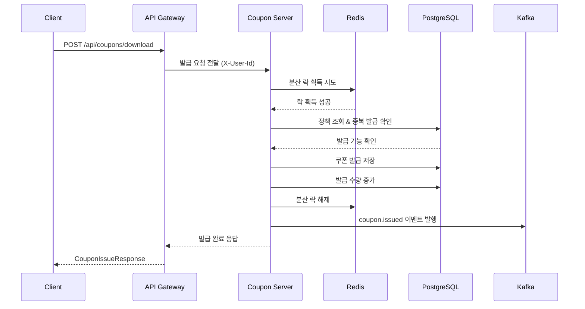
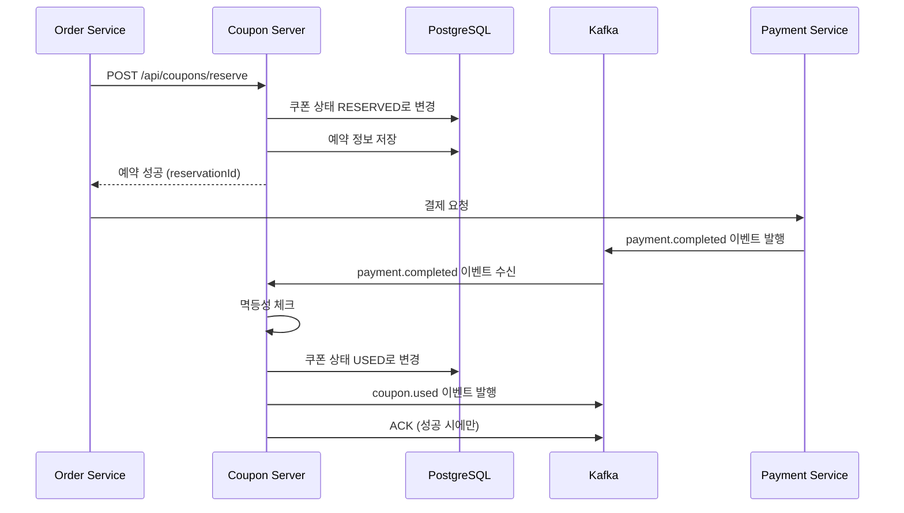
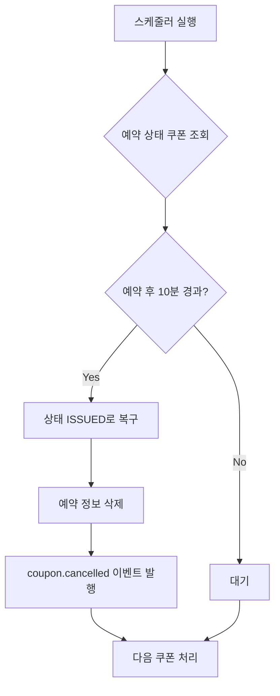
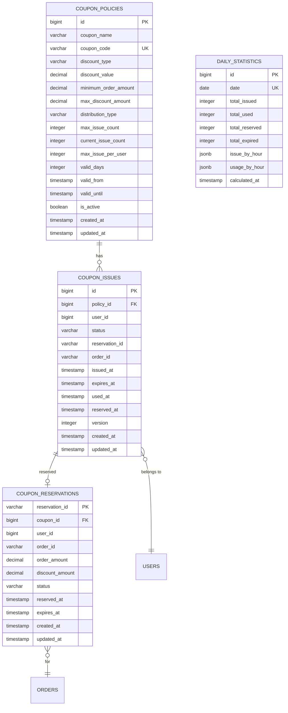
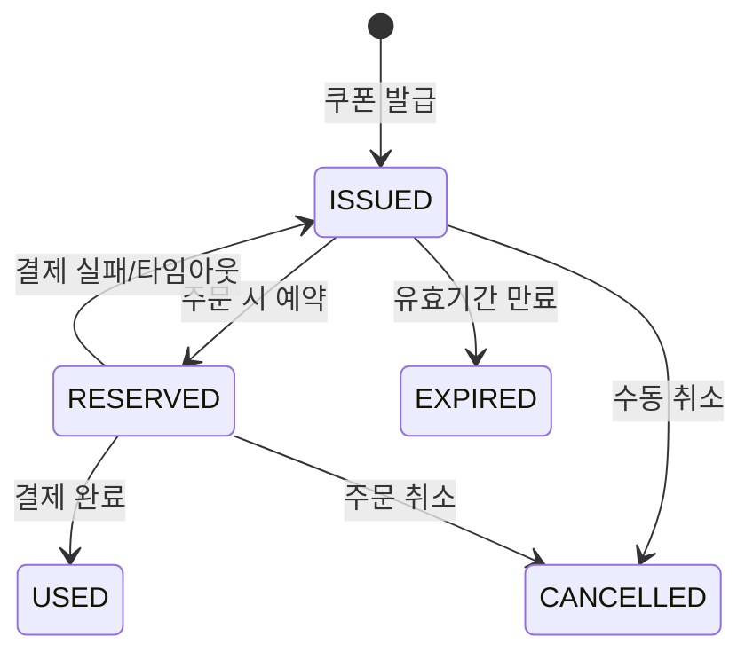
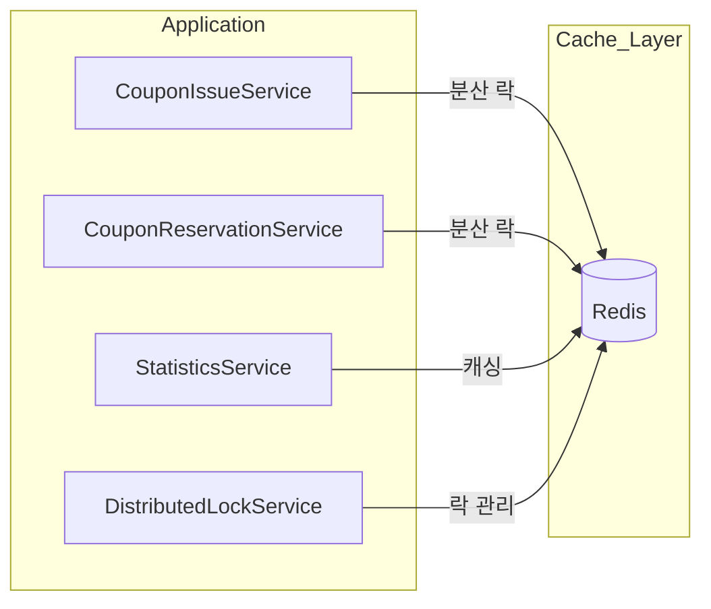
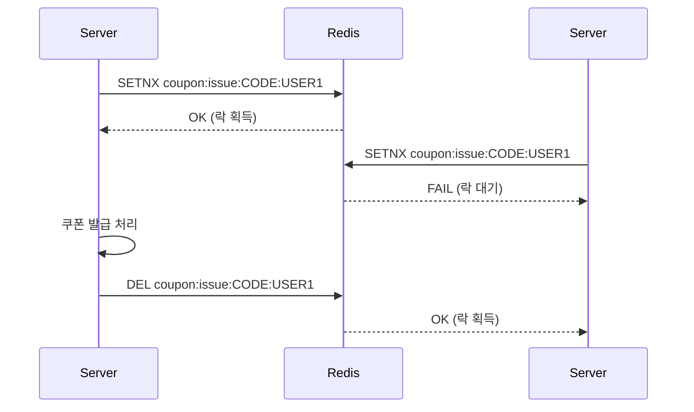

# Coupon-Server 가이드 문서

## 1. 개요

### 1.1 목적

Coupon-Server는 이커머스 플랫폼을 위한 독립적인 쿠폰 관리 마이크로서비스이다. 쿠폰 정책 생성, 발급, 사용, 통계 등 쿠폰 라이프사이클 전반을 관리한다.

### 1.2 주요 기능

| 기능         | 설명                                 |
|------------|------------------------------------|
| 쿠폰 정책 관리   | 할인 타입(정액/정률), 발급 조건, 유효 기간 설정      |
| 쿠폰 발급      | CODE, DOWNLOAD, FIRST_COME, DIRECT 발급 |
| 쿠폰 사용      | 2단계 커밋 (예약 → 사용 확정), 자동 타임아웃       |
| 동시성 제어     | Redis 분산 락, 낙관적 락을 통한 중복 발급 방지    |
| 결제 연동      | Kafka 이벤트 기반 결제 시스템 연동            |
| 통계 모니터링    | 실시간 발급/사용 통계, 쿠폰별 성과 분석          |

### 1.3 기술 스택

| 구분             | 기술                        |
|----------------|---------------------------|
| Framework      | Spring Boot 3.5.7         |
| Language       | Java 21 (Eclipse Temurin) |
| Database       | PostgreSQL 15             |
| Cache          | Redis 7                   |
| Message Broker | Apache Kafka              |
| Architecture   | Hexagonal Architecture    |
| Lock           | Redisson (분산 락)           |
| Documentation  | Swagger/OpenAPI 3.0       |

---

## 2. 시스템 아키텍처

### 2.1 전체 구조



### 2.2 헥사고날 아키텍처



### 2.3 쿠폰 발급 흐름



### 2.4 쿠폰 사용 흐름 (2단계 커밋)



### 2.5 쿠폰 타임아웃 처리



---

## 3. 데이터 모델

### 3.1 ERD



### 3.2 테이블 상세

#### coupon_policies (쿠폰 정책)

| 필드                   | 타입             | 필수 | 설명                                           |
|----------------------|----------------|----|----------------------------------------------|
| id                   | BIGSERIAL      | Y  | PK                                           |
| coupon_name          | VARCHAR(100)   | Y  | 쿠폰명                                          |
| coupon_code          | VARCHAR(50)    | Y  | 쿠폰 코드 (UNIQUE)                               |
| discount_type        | VARCHAR(20)    | Y  | FIXED_AMOUNT, PERCENTAGE                     |
| discount_value       | DECIMAL(10,2)  | Y  | 할인 값                                         |
| minimum_order_amount | DECIMAL(10,2)  | N  | 최소 주문 금액                                     |
| max_discount_amount  | DECIMAL(10,2)  | N  | 최대 할인 금액 (정률 할인 시)                           |
| distribution_type    | VARCHAR(20)    | Y  | CODE, DOWNLOAD, FIRST_COME, EVENT, DIRECT    |
| max_issue_count      | INTEGER        | N  | 최대 발급 수량                                     |
| current_issue_count  | INTEGER        | N  | 현재 발급 수량                                     |
| max_issue_per_user   | INTEGER        | N  | 사용자당 최대 발급 수 (기본: 1)                         |
| valid_days           | INTEGER        | Y  | 유효 기간 (일)                                    |
| valid_from           | TIMESTAMP      | Y  | 발급 시작일                                       |
| valid_until          | TIMESTAMP      | Y  | 발급 종료일                                       |
| is_active            | BOOLEAN        | Y  | 활성화 상태                                       |
| created_at           | TIMESTAMP      | N  | 생성 시간                                        |
| updated_at           | TIMESTAMP      | N  | 수정 시간                                        |

#### coupon_issues (발급된 쿠폰)

| 필드             | 타입           | 필수 | 설명                                           |
|----------------|--------------|-----|----------------------------------------------|
| id             | BIGSERIAL    | Y   | PK                                           |
| policy_id      | BIGINT       | Y   | FK to coupon_policies                        |
| user_id        | BIGINT       | Y   | 사용자 ID                                       |
| status         | VARCHAR(20)  | Y   | ISSUED, RESERVED, USED, EXPIRED, CANCELLED   |
| reservation_id | VARCHAR(50)  | N   | 예약 ID                                        |
| order_id       | VARCHAR(50)  | N   | 주문 ID                                        |
| issued_at      | TIMESTAMP    | Y   | 발급 시간                                        |
| expires_at     | TIMESTAMP    | Y   | 만료 시간                                        |
| used_at        | TIMESTAMP    | N   | 사용 시간                                        |
| reserved_at    | TIMESTAMP    | N   | 예약 시간                                        |
| version        | INTEGER      | N   | Optimistic Lock                              |
| created_at     | TIMESTAMP    | N   | 생성 시간                                        |
| updated_at     | TIMESTAMP    | N   | 수정 시간                                        |

#### coupon_reservations (쿠폰 예약)

| 필드              | 타입            | 필수 | 설명                                        |
|-----------------|---------------|-----|-------------------------------------------|
| reservation_id  | VARCHAR(50)   | Y   | PK                                        |
| coupon_id       | BIGINT        | Y   | FK to coupon_issues                       |
| user_id         | BIGINT        | Y   | 사용자 ID                                    |
| order_id        | VARCHAR(50)   | Y   | 주문 ID                                     |
| order_amount    | DECIMAL(10,2) | Y   | 주문 금액                                     |
| discount_amount | DECIMAL(10,2) | Y   | 할인 금액                                     |
| status          | VARCHAR(20)   | Y   | PENDING, CONFIRMED, CANCELLED, EXPIRED    |
| reserved_at     | TIMESTAMP     | Y   | 예약 시간                                     |
| expires_at      | TIMESTAMP     | Y   | 만료 시간                                     |
| created_at      | TIMESTAMP     | N   | 생성 시간                                     |
| updated_at      | TIMESTAMP     | N   | 수정 시간                                     |

---

## 4. API 명세

### 4.1 쿠폰 발급

#### 쿠폰 다운로드 (코드 입력)

```
POST /api/coupons/download
```

**Headers**

| 헤더        | 필수 | 설명            |
|-----------|----|---------------|
| X-User-Id | Y  | 사용자 ID        |

**Request**

| 필드         | 타입     | 필수 | 설명      |
|------------|--------|----|---------|
| couponCode | String | Y  | 쿠폰 코드   |
| userId     | Long   | Y  | 사용자 ID  |

**Request Example**

```json
{
  "couponCode": "WELCOME2024",
  "userId": 12345
}
```

**Response (201 Created)**

```json
{
  "couponId": 1001,
  "couponName": "신규 가입 쿠폰",
  "discountType": "FIXED_AMOUNT",
  "discountValue": 10000,
  "status": "ISSUED",
  "expiryDate": "2024-01-31T23:59:59",
  "issuedAt": "2024-01-01T10:00:00"
}
```

#### 직접 발급 (관리자)

```
POST /api/coupons/direct-issue
```

**Request**

```json
{
  "couponPolicyId": 1,
  "userIds": [12345, 12346, 12347],
  "issuedBy": "ADMIN"
}
```

**Response (201 Created)**

```json
{
  "totalRequested": 3,
  "successCount": 3,
  "failureCount": 0,
  "results": [
    {
      "userId": 12345,
      "couponId": 1001,
      "status": "SUCCESS"
    }
  ]
}
```

### 4.2 쿠폰 사용

#### 쿠폰 예약

```
POST /api/coupons/reserve
```

**Request**

```json
{
  "reservationId": "RESV-2024-0001",
  "userId": 12345,
  "couponId": 1001,
  "orderAmount": 100000
}
```

**Response (200 OK)**

```json
{
  "reservationId": "RESV-2024-0001",
  "couponId": 1001,
  "success": true,
  "message": "쿠폰이 성공적으로 예약되었습니다",
  "reservedAt": "2024-01-01T10:00:00"
}
```

#### 쿠폰 적용 (락 획득)

```
POST /api/coupons/apply
```

**Request**

```json
{
  "reservationId": "RESV-2024-0001",
  "userId": 12345,
  "couponId": 1001,
  "orderAmount": 100000
}
```

**Response (200 OK)**

```json
{
  "couponId": "1001",
  "couponName": "신규 회원 5000원 할인",
  "discountType": "FIXED_AMOUNT",
  "discountValue": 5000,
  "maxDiscountAmount": null
}
```

#### 쿠폰 락 해제

```
DELETE /api/coupons/apply/{reservationId}
```

### 4.3 쿠폰 조회

#### 사용자 쿠폰 목록 조회 (커서 기반)

```
GET /api/coupons/users/{userId}
```

**Query Parameters**

| 파라미터      | 타입     | 필수 | 설명                               |
|-----------|--------|----|----------------------------------|
| status    | String | N  | AVAILABLE, UNUSED, USED, EXPIRED |
| cursor    | Long   | N  | 마지막 쿠폰 ID                        |
| limit     | Int    | N  | 조회 개수 (기본: 20, 최대: 100)          |

**Response (200 OK)**

```json
{
  "coupons": [
    {
      "couponId": 1001,
      "couponName": "신규 가입 쿠폰",
      "discountType": "FIXED_AMOUNT",
      "discountValue": 10000,
      "status": "ISSUED",
      "expiryDate": "2024-01-31T23:59:59",
      "issuedAt": "2024-01-01T10:00:00"
    }
  ],
  "nextCursor": 1002,
  "hasMore": true
}
```

#### 만료 임박 쿠폰 조회

```
GET /api/coupons/users/{userId}/expiring
```

**Query Parameters**

| 파라미터  | 타입  | 필수 | 설명                |
|-------|-----|----|-------------------|
| days  | Int | N  | 만료까지 남은 일수 (기본: 7) |
| limit | Int | N  | 조회 개수 (기본: 10)    |

#### 사용자 쿠폰 통계

```
GET /api/coupons/users/{userId}/statistics
```

**Response (200 OK)**

```json
{
  "totalCoupons": 10,
  "availableCoupons": 5,
  "usedCoupons": 3,
  "expiredCoupons": 2,
  "totalSavedAmount": 30000
}
```

### 4.4 쿠폰 정책 관리

#### 남은 발급 수량 수정

```
PATCH /api/coupon-policies/{policyId}/remaining-quantity
```

**Request**

```json
{
  "newMaxIssueCount": 5000,
  "modifiedBy": "ADMIN",
  "reason": "추가 재고 할당"
}
```

**Response (200 OK)**

```json
{
  "couponPolicyId": 1,
  "previousMaxIssueCount": 1000,
  "newMaxIssueCount": 5000,
  "currentIssuedCount": 500,
  "remainingCount": 4500,
  "success": true
}
```

### 4.5 쿠폰 코드 유효성 확인

```
GET /api/coupons/validate/{couponCode}
```

**Response (200 OK)**

```json
{
  "couponCode": "WELCOME2024",
  "valid": true,
  "message": "사용 가능한 쿠폰입니다"
}
```

---

## 5. 이벤트 명세

### 5.1 Kafka Topics

| Topic                  | Producer       | Consumer       | 설명             |
|------------------------|----------------|----------------|----------------|
| coupon.issued          | Coupon Server  | Notification   | 쿠폰 발급 완료       |
| coupon.used            | Coupon Server  | Analytics      | 쿠폰 사용 완료       |
| coupon.reserved        | Coupon Server  | Order Server   | 쿠폰 예약          |
| coupon.expired         | Coupon Server  | Notification   | 쿠폰 만료          |
| coupon.cancelled       | Coupon Server  | Order Server   | 쿠폰 예약 취소       |
| payment.completed.v1   | Payment Server | Coupon Server  | 결제 완료 (사용 확정)  |
| payment.failed.v1      | Payment Server | Coupon Server  | 결제 실패 (롤백)     |

### 5.2 이벤트 페이로드

#### CouponIssuedEvent

```json
{
  "eventId": "evt_2024010110000001",
  "eventType": "COUPON_ISSUED",
  "timestamp": "2024-01-01T10:00:00Z",
  "data": {
    "couponId": 1001,
    "policyId": 1,
    "userId": 12345,
    "couponCode": "WELCOME2024",
    "couponName": "신규 가입 쿠폰",
    "discountType": "FIXED_AMOUNT",
    "discountValue": 10000,
    "status": "ISSUED",
    "expiryDate": "2024-01-31T23:59:59"
  },
  "metadata": {
    "correlationId": "corr_2024010110000001",
    "source": "coupon-service",
    "version": "1.0"
  }
}
```

#### PaymentCompletedEvent (구독)

```json
{
  "eventId": "evt_pay_2024010110000001",
  "eventType": "PAYMENT_COMPLETED",
  "timestamp": "2024-01-01T10:05:00Z",
  "data": {
    "paymentId": "PAY-2024-0001",
    "orderId": "ORDER-2024-0001",
    "userId": 12345,
    "amount": 90000,
    "couponId": 1001,
    "reservationId": "RESV-2024-0001",
    "completedAt": "2024-01-01T10:05:00"
  }
}
```

### 5.3 이벤트 처리 설정

| 설정           | 값                          |
|--------------|----------------------------|
| 동시 처리 스레드    | 10                         |
| ACK 모드       | MANUAL (수동 확인)             |
| 재시도 정책       | 비즈니스 로직 실패 시 재처리           |
| 멱등성          | reservationId/orderId 기반   |
| DLQ          | {original-topic}.DLQ       |

---

## 6. 비즈니스 규칙

### 6.1 쿠폰 상태 전이



### 6.2 발급 타입별 규칙

| 발급 타입      | 설명                 | 동시성 제어         |
|------------|--------------------|----------------|
| CODE       | 사용자가 쿠폰 코드 입력     | Redis 분산 락    |
| DOWNLOAD   | 사용자가 직접 다운로드      | 중복 발급 체크      |
| FIRST_COME | 선착순 발급            | Redis 분산 락 + 재고 관리 |
| EVENT      | 이벤트 기반 자동 발급      | Kafka 이벤트 처리  |
| DIRECT     | 관리자가 직접 발급        | 배치 처리         |

### 6.3 할인 타입별 규칙

| 할인 타입        | 설명        | 제약 조건                     |
|--------------|-----------|---------------------------|
| FIXED_AMOUNT | 정액 할인     | discount_value > 0        |
| PERCENTAGE   | 정률 할인 (%) | 0 < discount_value <= 100 |

### 6.4 예약 타임아웃 정책

| 규칙         | 설명                     |
|------------|------------------------|
| 타임아웃 시간   | 10분 (기본값)              |
| 스케줄러 주기   | 5분마다 실행               |
| 롤백 처리     | 상태 ISSUED로 복구, 예약 정보 삭제 |
| 이벤트 발행    | coupon.cancelled 발행    |

---

## 7. Redis 캐싱

### 7.1 캐시 아키텍처



### 7.2 캐시 키 설계

| 용도          | Key Pattern                      | Value Type  | TTL     |
|-------------|----------------------------------|-------------|---------|
| 발급 락        | `coupon:issue:{couponCode}:{userId}` | Lock        | 5초      |
| 예약 락        | `coupon:reserve:{couponId}`       | Lock        | 10분     |
| 재고 캐시       | `coupon:stock:{policyId}`         | Integer     | 5분      |
| 통계 캐시       | `coupon:stats:{policyId}`         | JSON        | 1분      |
| Rate Limit  | `rate:limit:{userId}`             | Counter     | 1분      |

### 7.3 Redisson 설정

```yaml
redisson:
  single-server-config:
    address: redis://localhost:26379
    connection-pool-size: 50
    connection-minimum-idle-size: 10
```

### 7.4 Rate Limiting

| 제한           | 값       |
|--------------|---------|
| 분당 요청 수      | 5회      |
| 시간당 요청 수     | 20회     |
| 차단 기간        | 24시간    |

---

## 8. 동시성 제어

### 8.1 분산 락 (Redisson)



### 8.2 낙관적 락 (JPA)

```java
@Entity
public class CouponIssue {
    @Version
    private Integer version;
}
```

### 8.3 동시성 제어 전략

| 상황            | 전략           | 설명                   |
|---------------|--------------|----------------------|
| 쿠폰 발급         | 분산 락         | Redis 기반 Lock        |
| 쿠폰 상태 변경      | 낙관적 락        | @Version 기반          |
| 재고 차감         | 원자적 연산       | Redis DECR           |
| 중복 발급 방지      | Unique Index | (policy_id, user_id) |

---

## 9. 인덱스 설계

### 9.1 coupon_policies 인덱스

```sql
-- 쿠폰 코드 검색
CREATE INDEX idx_coupon_code ON coupon_policies(coupon_code) WHERE is_active = TRUE;

-- 활성 정책 조회
CREATE INDEX idx_active_policies ON coupon_policies(is_active, valid_until);

-- 발급 기간 필터
CREATE INDEX idx_valid_period ON coupon_policies(valid_from, valid_until) WHERE is_active = TRUE;
```

### 9.2 coupon_issues 인덱스

```sql
-- 사용자별 쿠폰 조회
CREATE INDEX idx_user_status ON coupon_issues(user_id, status);

-- 활성 쿠폰 조회
CREATE INDEX idx_user_active ON coupon_issues(user_id, status, expires_at)
    WHERE status IN ('ISSUED', 'RESERVED');

-- 예약 조회
CREATE INDEX idx_reservation ON coupon_issues(reservation_id) WHERE reservation_id IS NOT NULL;

-- 타임아웃 체크
CREATE INDEX idx_timeout_check ON coupon_issues(status, reserved_at)
    WHERE status = 'RESERVED';

-- 중복 발급 방지
CREATE UNIQUE INDEX idx_unique_user_policy ON coupon_issues(policy_id, user_id)
    WHERE status NOT IN ('CANCELLED');
```

---

## 10. 에러 코드

### 10.1 쿠폰 정책 에러

| 코드                   | HTTP | 설명            |
|----------------------|------|---------------|
| POLICY_NOT_FOUND     | 404  | 쿠폰 정책을 찾을 수 없음 |
| POLICY_INACTIVE      | 400  | 비활성화된 쿠폰 정책   |
| DUPLICATE_COUPON_CODE | 409  | 중복된 쿠폰 코드     |

### 10.2 쿠폰 발급 에러

| 코드                        | HTTP | 설명           |
|---------------------------|------|--------------|
| COUPON_NOT_FOUND          | 404  | 쿠폰을 찾을 수 없음  |
| COUPON_CODE_NOT_FOUND     | 404  | 쿠폰 코드를 찾을 수 없음 |
| COUPON_ALREADY_ISSUED     | 409  | 이미 발급받은 쿠폰   |
| COUPON_ISSUE_LIMIT_EXCEEDED | 429  | 발급 한도 초과     |
| COUPON_SOLD_OUT           | 410  | 쿠폰 소진        |

### 10.3 쿠폰 사용 에러

| 코드                   | HTTP | 설명           |
|----------------------|------|--------------|
| COUPON_NOT_AVAILABLE | 400  | 사용 불가능한 쿠폰   |
| COUPON_ALREADY_USED  | 409  | 이미 사용된 쿠폰    |
| COUPON_EXPIRED       | 410  | 만료된 쿠폰       |
| MINIMUM_ORDER_NOT_MET | 400  | 최소 주문 금액 미달  |
| RESERVATION_NOT_FOUND | 404  | 예약 정보 없음     |
| RESERVATION_EXPIRED  | 410  | 예약 시간 만료     |

### 10.4 동시성 에러

| 코드                      | HTTP | 설명        |
|-------------------------|------|-----------|
| LOCK_ACQUISITION_FAILED | 409  | 락 획득 실패   |
| OPTIMISTIC_LOCK_FAILURE | 409  | 낙관적 락 충돌  |
| CONCURRENT_MODIFICATION | 409  | 동시 수정 감지  |

---

## 11. 환경 설정

### 11.1 환경 변수

```bash
# Database
DATABASE_HOST=localhost
DATABASE_PORT=25432
DATABASE_NAME=coupon_db
DATABASE_USER=coupon_user
DATABASE_PASSWORD=your_password

# Redis
REDIS_HOST=localhost
REDIS_PORT=26379

# Kafka
KAFKA_BOOTSTRAP_SERVERS=localhost:39092

# Application
SPRING_PROFILES_ACTIVE=local
COUPON_RESERVATION_TIMEOUT=10
```

### 11.2 application.yaml 주요 설정

```yaml
spring:
  application:
    name: coupon-service
  datasource:
    url: jdbc:postgresql://${DATABASE_HOST}:${DATABASE_PORT}/${DATABASE_NAME}
    hikari:
      maximum-pool-size: 10
      minimum-idle: 5
  kafka:
    consumer:
      group-id: coupon-service
      enable-auto-commit: false
    listener:
      ack-mode: manual
      concurrency: 10

coupon:
  reservation:
    timeout: ${COUPON_RESERVATION_TIMEOUT:10}
  scheduler:
    timeout:
      cron: "0 * * * * *"
    expiry:
      cron: "0 0 0 * * *"
    reservation-timeout:
      cron: "0 */5 * * * *"
```

### 11.3 Docker Compose

```yaml
version: '3.8'

services:
  postgres:
    image: postgres:15-alpine
    ports:
      - "25432:5432"
    environment:
      POSTGRES_DB: coupon_db
      POSTGRES_USER: coupon_user
      POSTGRES_PASSWORD: password
    volumes:
      - postgres_data:/var/lib/postgresql/data

  redis:
    image: redis:7-alpine
    ports:
      - "26379:6379"
    command: redis-server --appendonly yes

  zookeeper:
    image: confluentinc/cp-zookeeper:7.5.0
    ports:
      - "32181:2181"
    environment:
      ZOOKEEPER_CLIENT_PORT: 2181

  kafka:
    image: confluentinc/cp-kafka:7.5.0
    ports:
      - "39092:9092"
    environment:
      KAFKA_BROKER_ID: 1
      KAFKA_ZOOKEEPER_CONNECT: zookeeper:2181
      KAFKA_ADVERTISED_LISTENERS: PLAINTEXT://localhost:39092
      KAFKA_OFFSETS_TOPIC_REPLICATION_FACTOR: 1

volumes:
  postgres_data:
```

---

## 12. 스케줄링

### 12.1 스케줄 작업

| 작업            | 크론 표현식          | 설명                |
|---------------|-----------------|-------------------|
| 만료 쿠폰 처리      | `0 0 0 * * *`   | 매일 자정 만료 쿠폰 상태 변경 |
| 예약 타임아웃 처리    | `0 */5 * * * *` | 5분마다 타임아웃 예약 롤백  |
| 통계 집계         | `0 0 * * * *`   | 매시간 통계 데이터 갱신    |

### 12.2 ShedLock 설정

```java
@Scheduled(cron = "0 0 0 * * *")
@SchedulerLock(
    name = "expireCoupons",
    lockAtMostFor = "10m",
    lockAtLeastFor = "5m"
)
public void expireCoupons() {
    // 만료 쿠폰 처리
}
```

---

## 13. 성능 요구사항

### 13.1 목표 지표

| 지표           | 목표값            |
|--------------|----------------|
| 초당 쿠폰 발급     | 5,000건 이상      |
| API 응답 시간    | P95 < 100ms    |
| 가용성          | 99.9%          |
| Kafka 처리량    | 10,000 msg/s   |
| 동시 사용자       | 10,000+        |

### 13.2 최근 개선사항 (2024.12)

| 항목           | 이전     | 이후     | 개선율   |
|--------------|--------|--------|-------|
| Kafka 동시 처리  | 3 스레드  | 10 스레드 | 233%  |
| 이벤트 처리 시간   | 200ms  | 60ms   | 70%   |
| 배치 처리 단위    | 없음     | 100건   | -     |
| 테스트 커버리지    | -      | 85%+   | -     |

---

## 14. 문서 링크

### 아키텍처
- [시스템 아키텍처](docs/architecture/SYSTEM_ARCHITECTURE.md)
- [헥사고날 아키텍처](docs/architecture/HEXAGONAL_ARCHITECTURE.md)
- [기술 결정](docs/architecture/TECHNICAL_DECISIONS.md)
- [트레이드오프](docs/architecture/TRADE_OFFS.md)

### API
- [REST API 명세](docs/api/REST_API_SPECIFICATION.md)
- [이벤트 명세](docs/api/EVENT_SPECIFICATION.md)
- [에러 코드](docs/api/ERROR_CODES.md)

### 기능
- [쿠폰 정책](docs/features/COUPON_POLICY.md)
- [쿠폰 발급](docs/features/COUPON_ISSUE.md)
- [쿠폰 사용](docs/features/COUPON_USE.md)
- [통계](docs/features/STATISTICS.md)

### 데이터베이스
- [스키마](docs/database/SCHEMA.md)
- [인덱스 전략](docs/database/INDEX_STRATEGY.md)

### 배포
- [로컬 설정](docs/deployment/LOCAL_SETUP.md)
- [Docker Compose](docs/deployment/DOCKER_COMPOSE.md)
- [배포 가이드](docs/deployment/DEPLOYMENT_GUIDE.md)
- [모니터링](docs/deployment/MONITORING.md)

---

**버전**: 2.0.0
**최종 업데이트**: 2024-12-29
**팀**: TeamBind Development Team
