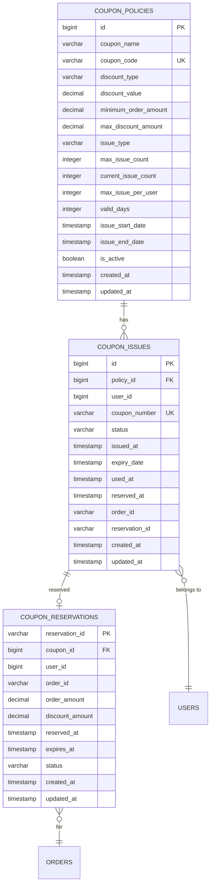

# 데이터베이스 스키마

## ERD (Entity Relationship Diagram)



## 테이블 정의

### 1. coupon_policies (쿠폰 정책)

```sql
CREATE TABLE coupon_policies (
    id BIGSERIAL PRIMARY KEY,
    coupon_name VARCHAR(100) NOT NULL,
    coupon_code VARCHAR(50) UNIQUE NOT NULL,
    discount_type VARCHAR(20) NOT NULL CHECK (discount_type IN ('FIXED_AMOUNT', 'PERCENTAGE')),
    discount_value DECIMAL(10,2) NOT NULL CHECK (discount_value > 0),
    minimum_order_amount DECIMAL(10,2) DEFAULT 0,
    max_discount_amount DECIMAL(10,2),
    issue_type VARCHAR(20) NOT NULL CHECK (issue_type IN ('CODE', 'DIRECT')),
    max_issue_count INTEGER,
    current_issue_count INTEGER DEFAULT 0,
    max_issue_per_user INTEGER DEFAULT 1,
    valid_days INTEGER NOT NULL,
    issue_start_date TIMESTAMP NOT NULL,
    issue_end_date TIMESTAMP NOT NULL,
    is_active BOOLEAN DEFAULT TRUE,
    created_at TIMESTAMP DEFAULT CURRENT_TIMESTAMP,
    updated_at TIMESTAMP DEFAULT CURRENT_TIMESTAMP,

    CONSTRAINT chk_dates CHECK (issue_end_date > issue_start_date),
    CONSTRAINT chk_percentage CHECK (
        discount_type != 'PERCENTAGE' OR discount_value <= 100
    )
);

-- 인덱스
CREATE INDEX idx_coupon_code ON coupon_policies(coupon_code) WHERE is_active = TRUE;
CREATE INDEX idx_active_policies ON coupon_policies(is_active, issue_end_date);
CREATE INDEX idx_issue_dates ON coupon_policies(issue_start_date, issue_end_date)
    WHERE is_active = TRUE;
```

### 2. coupon_issues (발급된 쿠폰)

```sql
CREATE TABLE coupon_issues (
    id BIGSERIAL PRIMARY KEY,
    policy_id BIGINT NOT NULL REFERENCES coupon_policies(id),
    user_id BIGINT NOT NULL,
    coupon_number VARCHAR(50) UNIQUE NOT NULL,
    status VARCHAR(20) NOT NULL DEFAULT 'ISSUED'
        CHECK (status IN ('ISSUED', 'RESERVED', 'USED', 'EXPIRED', 'CANCELLED')),
    issued_at TIMESTAMP NOT NULL DEFAULT CURRENT_TIMESTAMP,
    expiry_date TIMESTAMP NOT NULL,
    used_at TIMESTAMP,
    reserved_at TIMESTAMP,
    order_id VARCHAR(50),
    reservation_id VARCHAR(50),
    created_at TIMESTAMP DEFAULT CURRENT_TIMESTAMP,
    updated_at TIMESTAMP DEFAULT CURRENT_TIMESTAMP,

    CONSTRAINT chk_expiry CHECK (expiry_date > issued_at),
    CONSTRAINT chk_used_date CHECK (used_at IS NULL OR used_at >= issued_at),
    CONSTRAINT chk_reserved_date CHECK (reserved_at IS NULL OR reserved_at >= issued_at)
);

-- 인덱스
CREATE INDEX idx_user_coupons ON coupon_issues(user_id, status);
CREATE INDEX idx_policy_coupons ON coupon_issues(policy_id, status);
CREATE INDEX idx_coupon_number ON coupon_issues(coupon_number);
CREATE INDEX idx_expiry_date ON coupon_issues(expiry_date) WHERE status = 'ISSUED';
CREATE INDEX idx_reservation ON coupon_issues(reservation_id) WHERE reservation_id IS NOT NULL;

-- 복합 유니크 제약 (사용자당 정책별 중복 발급 방지)
CREATE UNIQUE INDEX idx_unique_user_policy ON coupon_issues(policy_id, user_id)
    WHERE status NOT IN ('CANCELLED');
```

### 3. coupon_reservations (쿠폰 예약)

```sql
CREATE TABLE coupon_reservations (
    reservation_id VARCHAR(50) PRIMARY KEY,
    coupon_id BIGINT NOT NULL REFERENCES coupon_issues(id),
    user_id BIGINT NOT NULL,
    order_id VARCHAR(50) NOT NULL,
    order_amount DECIMAL(10,2) NOT NULL,
    discount_amount DECIMAL(10,2) NOT NULL,
    reserved_at TIMESTAMP NOT NULL DEFAULT CURRENT_TIMESTAMP,
    expires_at TIMESTAMP NOT NULL,
    status VARCHAR(20) NOT NULL DEFAULT 'PENDING'
        CHECK (status IN ('PENDING', 'CONFIRMED', 'CANCELLED', 'EXPIRED')),
    cancelled_reason VARCHAR(255),
    created_at TIMESTAMP DEFAULT CURRENT_TIMESTAMP,
    updated_at TIMESTAMP DEFAULT CURRENT_TIMESTAMP,

    CONSTRAINT chk_amounts CHECK (discount_amount <= order_amount),
    CONSTRAINT chk_expires CHECK (expires_at > reserved_at)
);

-- 인덱스
CREATE INDEX idx_reservation_status ON coupon_reservations(status, expires_at);
CREATE INDEX idx_user_reservations ON coupon_reservations(user_id, status);
CREATE INDEX idx_order_reservation ON coupon_reservations(order_id);
CREATE INDEX idx_expired_reservations ON coupon_reservations(expires_at)
    WHERE status = 'PENDING';
```

### 4. coupon_issue_audit (발급 감사 로그)

```sql
CREATE TABLE coupon_issue_audit (
    id BIGSERIAL PRIMARY KEY,
    coupon_id BIGINT,
    user_id BIGINT,
    action VARCHAR(50) NOT NULL,
    details JSONB,
    client_ip VARCHAR(45),
    user_agent VARCHAR(255),
    created_at TIMESTAMP DEFAULT CURRENT_TIMESTAMP
);

-- 인덱스
CREATE INDEX idx_audit_coupon ON coupon_issue_audit(coupon_id);
CREATE INDEX idx_audit_user ON coupon_issue_audit(user_id);
CREATE INDEX idx_audit_created ON coupon_issue_audit(created_at DESC);
```

### 5. daily_statistics (일일 통계)

```sql
CREATE TABLE daily_statistics (
    id BIGSERIAL PRIMARY KEY,
    date DATE UNIQUE NOT NULL,
    total_issued INTEGER DEFAULT 0,
    total_used INTEGER DEFAULT 0,
    total_reserved INTEGER DEFAULT 0,
    total_expired INTEGER DEFAULT 0,
    total_cancelled INTEGER DEFAULT 0,
    issue_by_hour JSONB,
    usage_by_hour JSONB,
    top_policies JSONB,
    calculated_at TIMESTAMP NOT NULL,
    created_at TIMESTAMP DEFAULT CURRENT_TIMESTAMP
);

-- 인덱스
CREATE INDEX idx_statistics_date ON daily_statistics(date DESC);
```

## 파티셔닝 전략

### 쿠폰 발급 테이블 파티셔닝

```sql
-- 월별 파티셔닝 (2024년 예시)
CREATE TABLE coupon_issues_2024_01 PARTITION OF coupon_issues
    FOR VALUES FROM ('2024-01-01') TO ('2024-02-01');

CREATE TABLE coupon_issues_2024_02 PARTITION OF coupon_issues
    FOR VALUES FROM ('2024-02-01') TO ('2024-03-01');

-- 자동 파티션 생성 함수
CREATE OR REPLACE FUNCTION create_monthly_partition()
RETURNS void AS $$
DECLARE
    start_date date;
    end_date date;
    partition_name text;
BEGIN
    start_date := date_trunc('month', CURRENT_DATE);
    end_date := start_date + interval '1 month';
    partition_name := 'coupon_issues_' || to_char(start_date, 'YYYY_MM');

    EXECUTE format('CREATE TABLE IF NOT EXISTS %I PARTITION OF coupon_issues
        FOR VALUES FROM (%L) TO (%L)',
        partition_name, start_date, end_date);
END;
$$ LANGUAGE plpgsql;

-- 월별 스케줄러
CREATE EXTENSION IF NOT EXISTS pg_cron;
SELECT cron.schedule('create-partition', '0 0 25 * *',
    'SELECT create_monthly_partition()');
```

## 뷰 (Views)

### 활성 쿠폰 뷰

```sql
CREATE VIEW v_active_coupons AS
SELECT
    ci.id,
    ci.user_id,
    ci.coupon_number,
    cp.coupon_name,
    cp.discount_type,
    cp.discount_value,
    ci.expiry_date,
    ci.status
FROM coupon_issues ci
JOIN coupon_policies cp ON ci.policy_id = cp.id
WHERE ci.status = 'ISSUED'
    AND ci.expiry_date > CURRENT_TIMESTAMP;
```

### 쿠폰 사용 통계 뷰

```sql
CREATE MATERIALIZED VIEW mv_coupon_statistics AS
SELECT
    cp.id AS policy_id,
    cp.coupon_name,
    cp.max_issue_count,
    COUNT(ci.id) AS total_issued,
    COUNT(ci.id) FILTER (WHERE ci.status = 'USED') AS total_used,
    COUNT(ci.id) FILTER (WHERE ci.status = 'RESERVED') AS total_reserved,
    COUNT(ci.id) FILTER (WHERE ci.status = 'EXPIRED') AS total_expired,
    CASE
        WHEN COUNT(ci.id) > 0
        THEN ROUND(COUNT(ci.id) FILTER (WHERE ci.status = 'USED')::NUMERIC / COUNT(ci.id) * 100, 2)
        ELSE 0
    END AS usage_rate
FROM coupon_policies cp
LEFT JOIN coupon_issues ci ON cp.id = ci.policy_id
GROUP BY cp.id, cp.coupon_name, cp.max_issue_count;

-- 매시간 갱신
CREATE EXTENSION IF NOT EXISTS pg_cron;
SELECT cron.schedule('refresh-statistics', '0 * * * *',
    'REFRESH MATERIALIZED VIEW CONCURRENTLY mv_coupon_statistics');
```

## 함수 및 프로시저

### 쿠폰 발급 프로시저

```sql
CREATE OR REPLACE FUNCTION issue_coupon(
    p_policy_id BIGINT,
    p_user_id BIGINT
) RETURNS TABLE(
    coupon_id BIGINT,
    coupon_number VARCHAR,
    status VARCHAR
) AS $$
DECLARE
    v_policy RECORD;
    v_existing_count INT;
    v_coupon_number VARCHAR;
    v_coupon_id BIGINT;
BEGIN
    -- 정책 조회 (락 획득)
    SELECT * INTO v_policy
    FROM coupon_policies
    WHERE id = p_policy_id
        AND is_active = TRUE
    FOR UPDATE;

    IF NOT FOUND THEN
        RAISE EXCEPTION 'Policy not found or inactive';
    END IF;

    -- 발급 한도 체크
    IF v_policy.max_issue_count IS NOT NULL
        AND v_policy.current_issue_count >= v_policy.max_issue_count THEN
        RAISE EXCEPTION 'Coupon sold out';
    END IF;

    -- 사용자별 발급 한도 체크
    SELECT COUNT(*) INTO v_existing_count
    FROM coupon_issues
    WHERE policy_id = p_policy_id
        AND user_id = p_user_id
        AND status != 'CANCELLED';

    IF v_existing_count >= v_policy.max_issue_per_user THEN
        RAISE EXCEPTION 'User issue limit exceeded';
    END IF;

    -- 쿠폰 번호 생성
    v_coupon_number := 'CPN' || EXTRACT(EPOCH FROM CURRENT_TIMESTAMP)::TEXT ||
                      LPAD((RANDOM() * 9999)::INT::TEXT, 4, '0');

    -- 쿠폰 발급
    INSERT INTO coupon_issues (
        policy_id, user_id, coupon_number, status,
        issued_at, expiry_date
    ) VALUES (
        p_policy_id, p_user_id, v_coupon_number, 'ISSUED',
        CURRENT_TIMESTAMP, CURRENT_TIMESTAMP + (v_policy.valid_days || ' days')::INTERVAL
    ) RETURNING id INTO v_coupon_id;

    -- 정책 발급 수량 증가
    UPDATE coupon_policies
    SET current_issue_count = current_issue_count + 1
    WHERE id = p_policy_id;

    RETURN QUERY
    SELECT v_coupon_id, v_coupon_number, 'ISSUED'::VARCHAR;
END;
$$ LANGUAGE plpgsql;
```

## 트리거

### 업데이트 시간 자동 갱신

```sql
CREATE OR REPLACE FUNCTION update_updated_at()
RETURNS TRIGGER AS $$
BEGIN
    NEW.updated_at = CURRENT_TIMESTAMP;
    RETURN NEW;
END;
$$ LANGUAGE plpgsql;

-- 각 테이블에 트리거 적용
CREATE TRIGGER trigger_update_coupon_policies
    BEFORE UPDATE ON coupon_policies
    FOR EACH ROW
    EXECUTE FUNCTION update_updated_at();

CREATE TRIGGER trigger_update_coupon_issues
    BEFORE UPDATE ON coupon_issues
    FOR EACH ROW
    EXECUTE FUNCTION update_updated_at();

CREATE TRIGGER trigger_update_coupon_reservations
    BEFORE UPDATE ON coupon_reservations
    FOR EACH ROW
    EXECUTE FUNCTION update_updated_at();
```

### 감사 로그 트리거

```sql
CREATE OR REPLACE FUNCTION audit_coupon_changes()
RETURNS TRIGGER AS $$
BEGIN
    IF TG_OP = 'INSERT' THEN
        INSERT INTO coupon_issue_audit (
            coupon_id, user_id, action, details
        ) VALUES (
            NEW.id, NEW.user_id, 'ISSUED',
            row_to_json(NEW)
        );
    ELSIF TG_OP = 'UPDATE' AND OLD.status != NEW.status THEN
        INSERT INTO coupon_issue_audit (
            coupon_id, user_id, action, details
        ) VALUES (
            NEW.id, NEW.user_id, 'STATUS_CHANGED',
            jsonb_build_object(
                'old_status', OLD.status,
                'new_status', NEW.status
            )
        );
    END IF;
    RETURN NEW;
END;
$$ LANGUAGE plpgsql;

CREATE TRIGGER trigger_audit_coupon_issues
    AFTER INSERT OR UPDATE ON coupon_issues
    FOR EACH ROW
    EXECUTE FUNCTION audit_coupon_changes();
```

## 백업 및 복구 전략

### 백업 정책

```bash
# 일일 전체 백업
0 2 * * * pg_dump -h localhost -U coupon_user -d coupon_db -f /backup/coupon_db_$(date +\%Y\%m\%d).sql

# 시간별 증분 백업
0 * * * * pg_basebackup -D /backup/incremental/$(date +\%Y\%m\%d\%H) -Ft -z -P

# S3 업로드
0 3 * * * aws s3 cp /backup/coupon_db_$(date +\%Y\%m\%d).sql s3://backup-bucket/postgres/
```

### 복구 절차

```sql
-- Point-in-Time Recovery
-- 1. WAL 아카이브 설정
ALTER SYSTEM SET archive_mode = on;
ALTER SYSTEM SET archive_command = 'cp %p /archive/%f';

-- 2. 복구 수행
pg_ctl stop -D /var/lib/postgresql/data
pg_basebackup -D /var/lib/postgresql/data_new -R
pg_ctl start -D /var/lib/postgresql/data_new
```